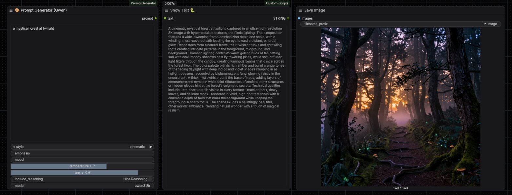
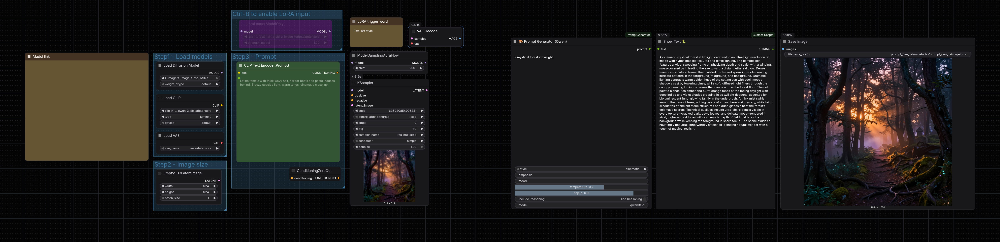

# 🎨 ComfyUI Prompt Generator

Generate detailed Stable Diffusion prompts using **Qwen3-8B** via Ollama, directly within ComfyUI.




## Features

- **7 Style Presets**: Cinematic, Anime, Photorealistic, Fantasy, Abstract, Cyberpunk, Sci-Fi
- **Temperature & Top-P Controls**: Fine-tune generation creativity
- **Focus Area (Emphasis)**: Direct the prompt to emphasize specific aspects
- **Mood/Atmosphere**: Set the emotional tone of the generated prompt
- **Reasoning Toggle**: Show or hide the model's thinking process

## Prerequisites

1. **Ollama** installed and running: [https://ollama.ai](https://ollama.ai)
2. **Qwen3-8B** model pulled:

   ```bash
   ollama pull qwen3:8b
   ```

## Installation

### Option 1: Clone to custom_nodes (Recommended)

```bash
cd /path/to/ComfyUI/custom_nodes
git clone https://github.com/Limbicnation/ComfyUI-PromptGenerator.git
cd ComfyUI-PromptGenerator
pip install -r requirements.txt
```

### Option 2: ComfyUI Manager

Search for "Prompt Generator" in the ComfyUI Manager and install.

## Usage

1. Restart ComfyUI after installation
2. Right-click → Add Node → `text/generation` → **🎨 Prompt Generator (Qwen)**
3. Connect the output `prompt` to your text encoder or save node

### Node Inputs

| Input | Type | Description |
|-------|------|-------------|
| `description` | STRING | Your image concept (required) |
| `style` | COMBO | Style preset (cinematic, anime, etc.) |
| `emphasis` | STRING | Focus area (optional) |
| `mood` | STRING | Atmosphere/mood (optional) |
| `temperature` | FLOAT | Creativity (0.1-1.0, default: 0.7) |
| `top_p` | FLOAT | Sampling threshold (0.1-1.0, default: 0.9) |
| `include_reasoning` | BOOLEAN | Show model's thinking process |
| `model` | STRING | Ollama model (default: qwen3:8b) |

### Example Workflow

Download the example workflow: [workflow/workflow.png](workflow/workflow.png)



## Customizing Styles

Edit `config/templates.yaml` to add or modify style templates. Templates use Jinja2 syntax:

```yaml
my_custom_style:
  name: "My Style"
  description: "Description for UI"
  template: |
    Write a prompt for: {{ description }}
    Focus on: {{ emphasis }}
    Mood: {{ mood }}
```

## Troubleshooting

### "Ollama not found"

- Ensure Ollama is installed and the `ollama` command is in your PATH
- Start the Ollama server: `ollama serve`

### "Model not found"

- Pull the model: `ollama pull qwen3:8b`

### Temperature/Top-P not working

- Install the Ollama Python package: `pip install ollama`

## License

Apache 2.0 - See [LICENSE](LICENSE) for details.

## Related Projects

- **[Prompt Generator (Gradio App)](https://github.com/Limbicnation/prompt-gen)** - Standalone Gradio web UI for prompt generation

## Credits

This ComfyUI node is based on the [prompt-gen](https://github.com/Limbicnation/prompt-gen) project.
